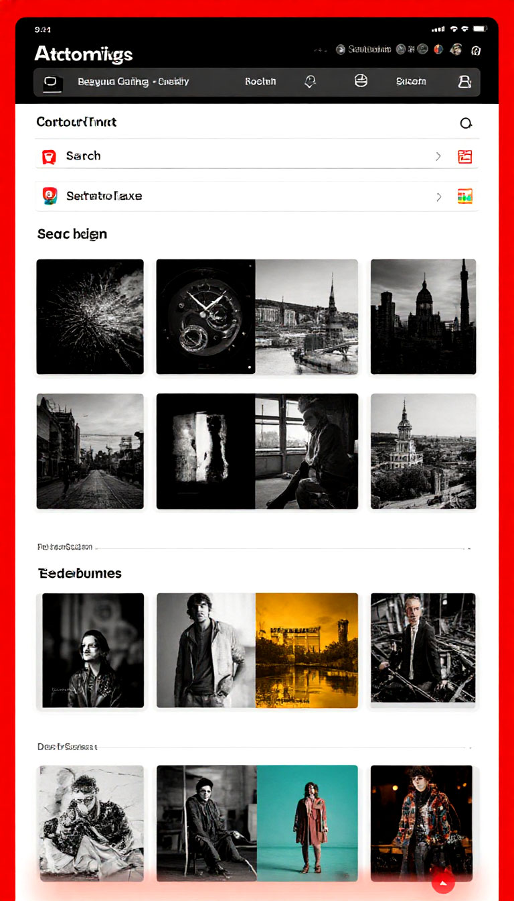

# PICTURE SAVER

Проект пренданзначен для distraction free работы с сохраняемыми изображениями.
В отличие от Pinterest (и других сервисов) предоставляет пользователю полный контроль за его временем и рабочим пространством, не пытаясь "подсунуть" дополнительный контент.

## Основной функционал
- Импорт изображений из файла (ов) и по web-ссылке (MVP)
- Импорт изображений из web-страниц 
- Импорт изображений сгенерированных ИИ по промпту 
- Отображение сохраненных изображений в виде галереи (MVP)
- Аннотирование/Тегирование изображений вручную и с помощью ИИ (включая анализ изображений и текста рядом с изображением) (MVP)
- Поиск изображений с использованием ИИ (например, фото на которым крупным планом изображен советский военный - [[1]](./imgs/Pic_1.jpg) [[2]](./imgs/Pic_2.jpg))
- Экспорт изображений в публичные сервисы (Pinterest, Google Photo, Яндекс Облако)
- Возможность хранить информацию на собственном сервере (БД и изображения)

\* В скобках указан функционал для реализации в рамках курса (MVP)

## Визуальная схема фронтенда

## Документация

1. Маркетинг и аналитика
    1. [Целевая аудитория](./docs/01-biz/01-target-audience.md)
    2. [Пользовательские истории](./docs/01-biz/03-bizreq.md)
2. Аналитика:
    1. [Функциональные требования](./docs/02-analysis/01-functional-requiremens.md)
    2. [Нефункциональные требования](./docs/02-analysis/02-nonfunctional-requirements.md)
3. Архитектура
    1. ADR
       - [ADR-001: Список выбранных технологий](docs/03-architecture/ADR/adr-000.md)  
    2. [Описание API](docs/03-architecture/02-api.md)
    3. [Архитектурные схемы](docs/03-architecture/03-arch.md)
4. DevOps
    1. [Файлы сборки](./deploy)
    2. [Заметки](docs/04-devops/01-notes.md) 

# Структура проекта

- lessons - Модуль освоения Gradle
- build-plugin - Модуль с плагинами, включая Native (в проекте будет использоваться только JVM)
- project-build - Проект
- docs, imgs - Папки для документов и изображений
- specs - Описание OpenAPI

## Проектные модули

### Транспортные модели, API

# TODO List

- Проработка спецификация OpenAPI
- Генерация транспортных моделей
- Генерация внутренних моделей
- Интеграция с TestContainers
- Логи envoy парсить в OpenSearch
- Логи Minio в OpenSearch
