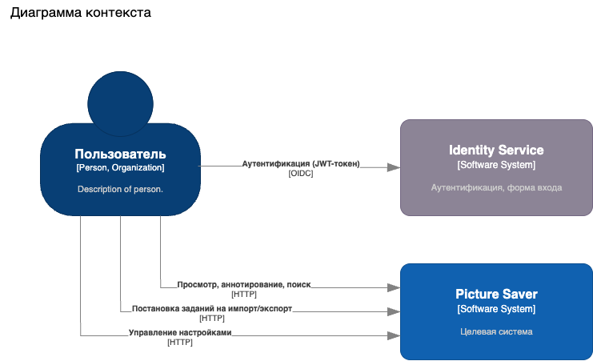
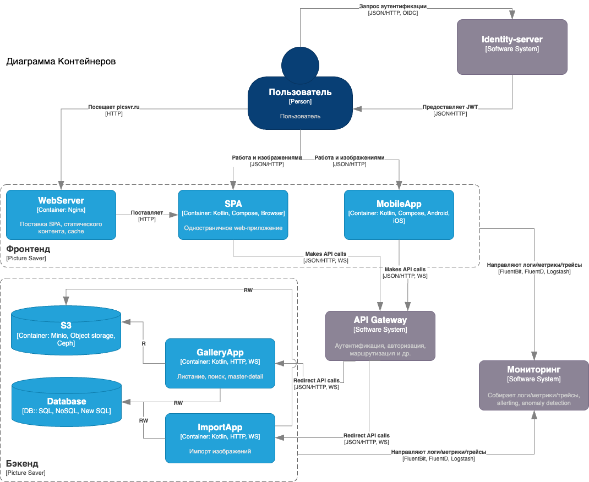
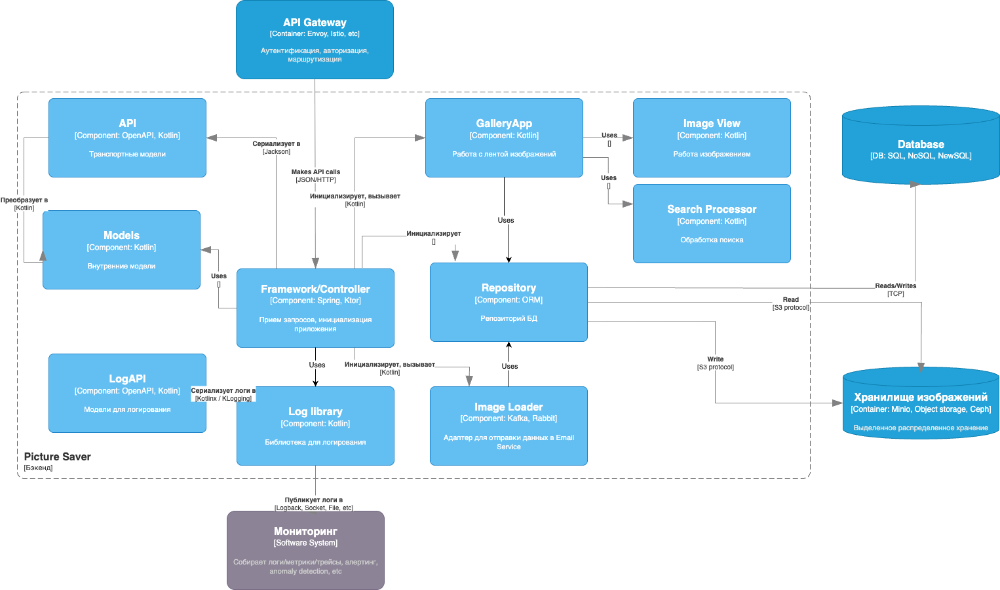
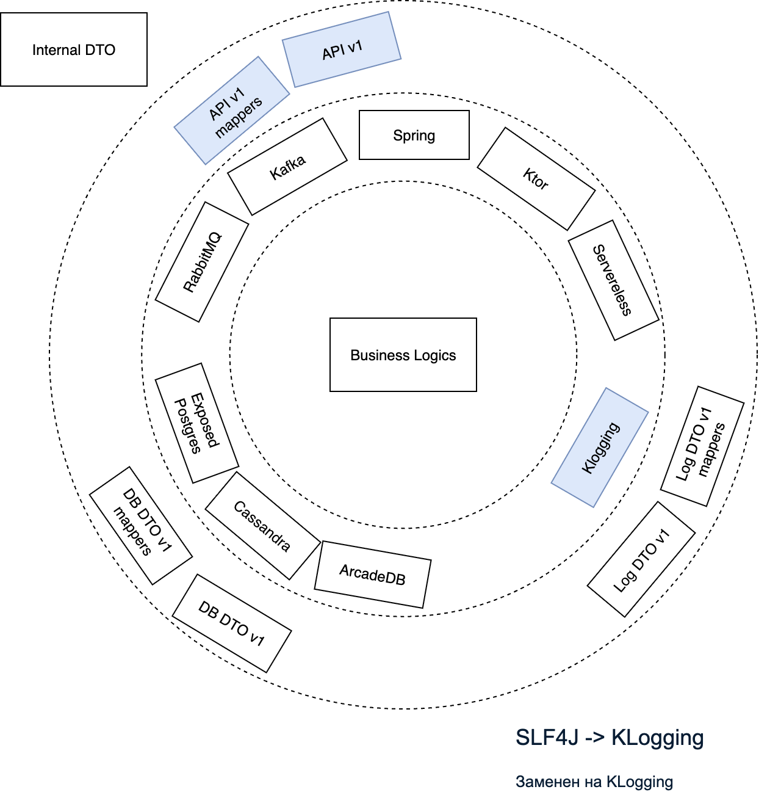

# Архитектурная диаграмма

**Исходный документ с диаграммами находится в папке** [imgs](../../imgs/Arch.Pic.Saver.drawio)

## Диаграмма контекста C4

## Диаграмма контейнеров C4

## Диаграмма компонентов C4

## Упрощенная (луковичная) диаграмма компонентов

